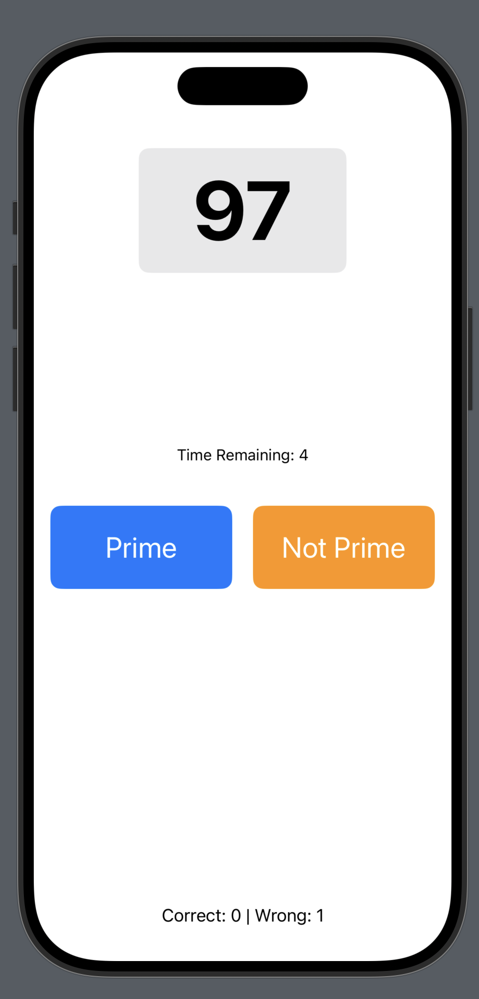
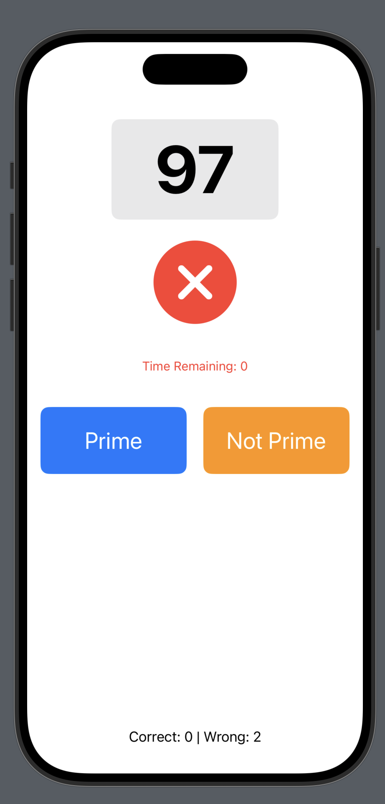
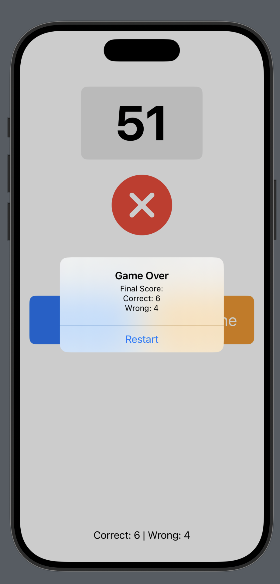

# Prime Number Game - iOS App 📱

A simple SwiftUI game where the player determines whether a displayed number is **prime or not** before the timer runs out. The game tracks correct and incorrect answers and ends after 10 rounds.

## 📌 Features
- Generates a random number between **1 and 100**.
- Player selects **"Prime"** or **"Not Prime"** before the **5-second timer** expires.
- If time runs out, the answer is automatically marked incorrect.
- Game **tracks correct & incorrect answers** and displays a score after 10 rounds.
- **Visual feedback** (✔️ or ❌) for correct and incorrect selections.
- Game resets with a new round after each answer.
- **Game Over screen** at the end of 10 rounds.

## 🖥️ Screenshots
### 🎮 Gameplay

### ⏳ Timer Ending

### 🏁 Game Over Screen

## 🛠️ Author: Brendan Dasilva
